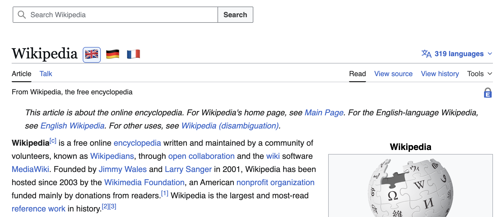

# Wikipedia Language Shortcuts
Built mostly by GPT-5.3 Codex using [opencode](https://opencode.ai).

Chrome extension that adds language flag shortcuts next to Wikipedia article titles and can auto-redirect article pages to your preferred language when available.

## Screenshot

## Features

- Flag shortcuts next to article title
- Configurable displayed languages
- Optional default redirect language for article pages only
- Redirect fallback: stays on current article if default language version is unavailable
- Manual switch override: clicking a flag allows visiting non-default languages without instant redirect back

## Install Locally

1. Open `chrome://extensions`.
2. Enable **Developer mode**.
3. Click **Load unpacked**.
4. Select this project folder.

## Configure

1. In the extension card, open **Details**.
2. Click **Extension options**.
3. Choose displayed languages.
4. Optionally choose a default redirect language.

## Notes

- Matches `*://*.wikipedia.org/wiki/*`.
- Non-article namespaces like `Special:` and `Talk:` are excluded from redirect behavior.
- Add your screenshot at `assets/screenshot.png`.
